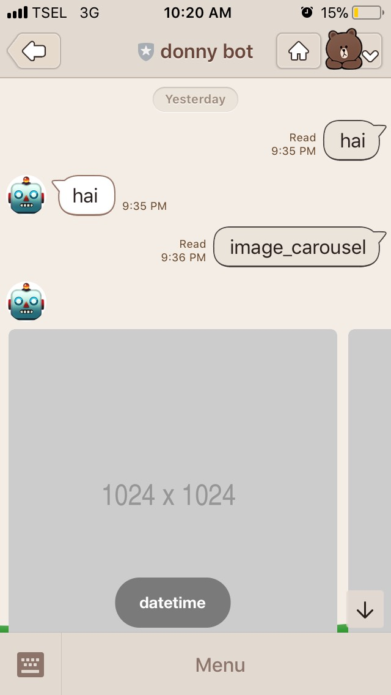
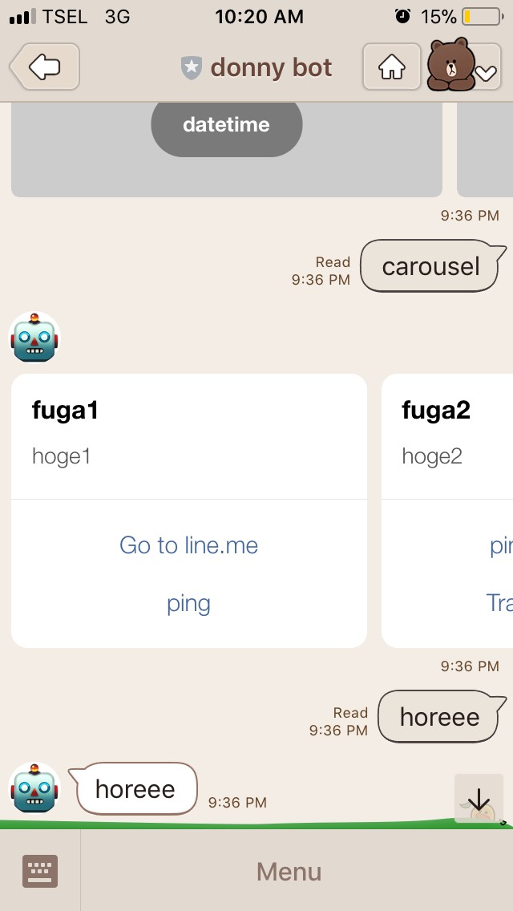

# linebot
Simple line bot creation using Python.


## Requirements
- Line SDK

```bash
    $ pip install line-bot-sdk
```

- Web development micro framework

```bash
    $ pip install Flask
```
- Deploy project to Heroku

[](https://heroku.com/deploy?template=https://github.com/ostriandoni/linebot)


## Setup Messaging API
Go to Line Developer Console, do as follows:
- Fill in Basic Information section
- Issue Channel Access Token (will use it later)
- Use Webhooks set as Enabled
- Webhook URL set as https://{YOUR_HEROKU_SERVER_ID}.herokuapp.com/callback


## Setup Environment
Go to Heroku dashboard > Settings > Config Variables, add following app's secrets:

```bash
LINE_CHANNEL_SECRET='xxx'
LINE_CHANNEL_ACCESS_TOKEN='xxx'
```


## Result



